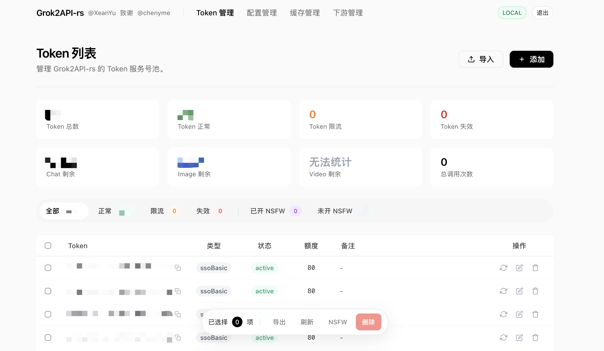
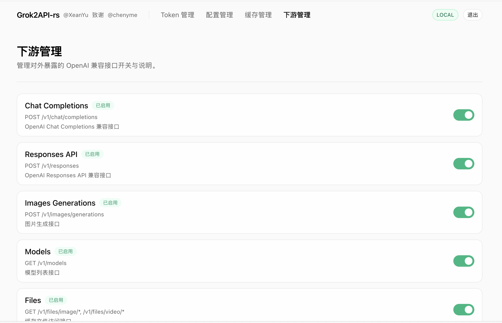
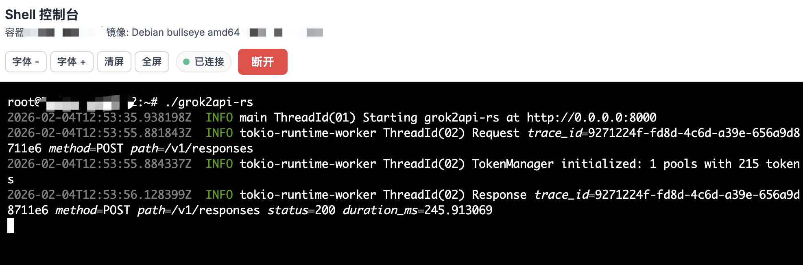
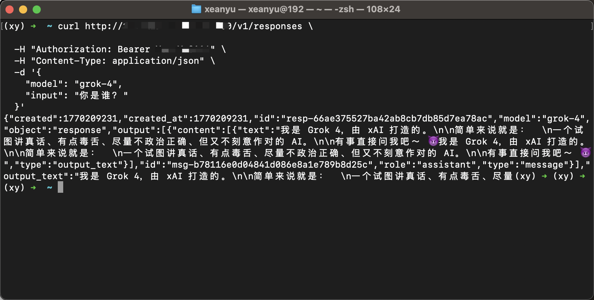
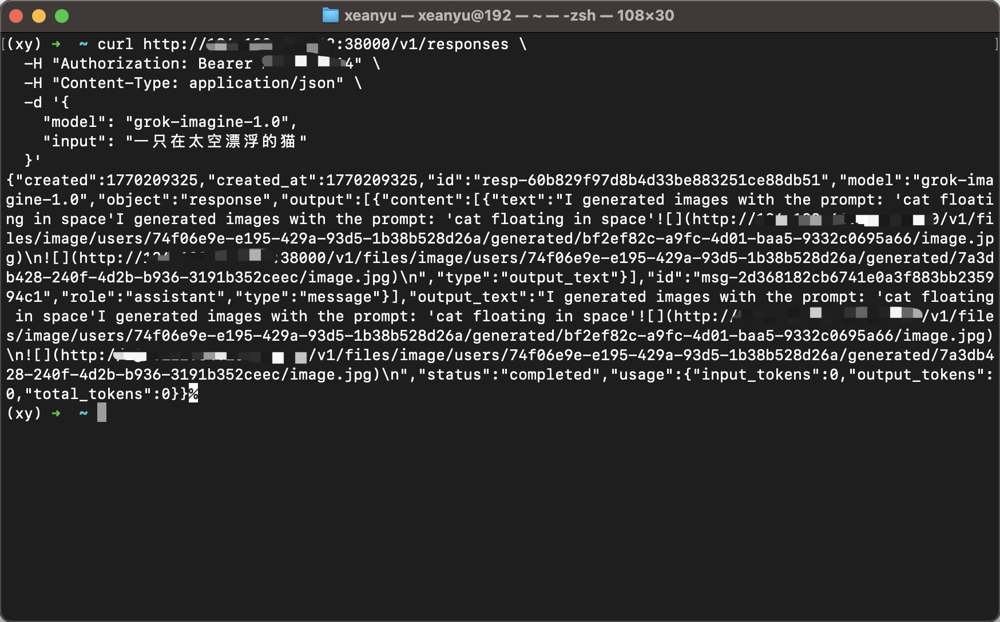
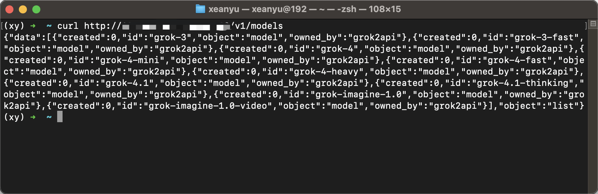
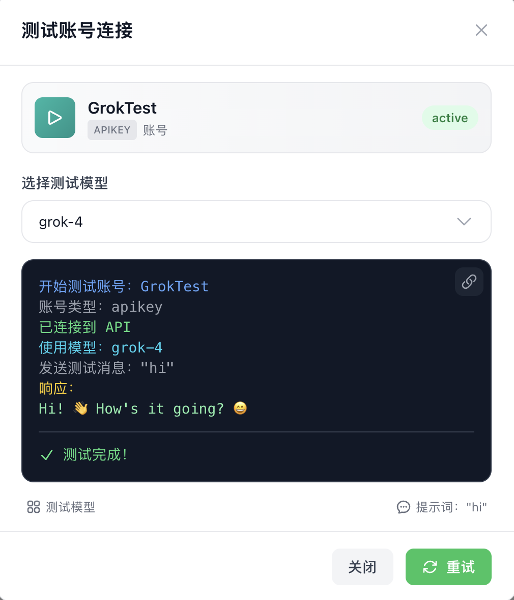

# Grok2API-rs

> 本项目基于 [grok2api](https://github.com/chenyme/grok2api) 重构。

> [!NOTE]
> 仅供学习与研究。请遵守 Grok 服务条款与当地法律法规。

## 项目简介

`Grok2API-rs` 是一个 Rust 实现的 Grok 转 OpenAI 兼容网关，包含管理后台（Token、配置、缓存、下游开关、对话调试）。

- 后端：Rust + Axum
- 部署：单二进制 / Docker
- 上游请求：统一使用内置 `wreq`（不依赖外部 `curl-impersonate`）
- 接口：`/v1/chat/completions`、`/v1/responses`、`/v1/images/generations`、`/v1/images/generations/nsfw` 等

系统首页截图：  


## v0.2.0 更新内容

- NSFW 开启链路稳态修复（含失败回退与错误明细）。
- 新增管理后台「对话」页面（支持 Chat / Responses / Images / Images NSFW）。
- 对话页面支持 SSE 流式、Markdown 渲染、图片（URL/Base64）展示。
- 新增「下游管理」页面，可按接口开关暴露下游 API。
- 提供 Docker 部署方案与 GHCR 自动发布工作流。

下游管理截图：  


## 下游接口列表

| 接口 | 路径 | 开关项 |
| --- | --- | --- |
| Chat Completions | `/v1/chat/completions` | `downstream.enable_chat_completions` |
| Responses API | `/v1/responses` | `downstream.enable_responses` |
| Images Generations | `/v1/images/generations` | `downstream.enable_images` |
| Images NSFW | `/v1/images/generations/nsfw` | `downstream.enable_images_nsfw` |
| Models | `/v1/models` | `downstream.enable_models` |
| Files | `/v1/files` | `downstream.enable_files` |

后台入口：`/admin`（Token 管理 / 配置管理 / 缓存管理 / 下游管理 / 对话）。

## 部署

### 1) 单二进制部署

```bash
# 假设当前目录下已有 grok2api-rs 与 config.defaults.toml
mkdir -p data
cp config.defaults.toml data/config.toml
cp /path/to/token.json data/token.json

chmod +x ./grok2api-rs
SERVER_HOST=0.0.0.0 SERVER_PORT=8000 ./grok2api-rs
```

目录参考：

```text
grok2api-rs/
├─ grok2api-rs
└─ data/
   ├─ config.toml
   └─ token.json
```

系统部署执行截图：  


### 2) Docker 快捷部署（推荐）

```bash
git clone https://github.com/XeanYu/grok2api-rs.git
cd grok2api-rs

mkdir -p data
cp config.defaults.toml data/config.toml
cp data/token.json.example data/token.json

# 也可不手动复制 token.json，容器首次启动会自动创建 {"ssoBasic": []}
docker compose pull
docker compose up -d
docker compose logs -f
```

然后打开后台导入 token：

- `http://127.0.0.1:8000/admin`
- 进入「Token 管理」导入/粘贴 `ssoBasic`

本地构建镜像后运行：

```bash
docker build -t grok2api-rs:local .
IMAGE=grok2api-rs:local docker compose up -d
```

### 3) 使用最新镜像升级

```bash
docker pull ghcr.io/xeanyu/grok2api-rs:latest
```
```bash
docker run -d \
  --name grok2api \
  -p 8000:8000 \
  ghcr.io/xeanyu/grok2api-rs:latest
```

### 4) GitHub Actions 自动发布镜像

仓库已包含 `.github/workflows/docker-publish.yml`：

- push 到 `main`：发布 `ghcr.io/xeanyu/grok2api-rs:latest`
- push tag（例如 `v0.2.0`）：发布 `ghcr.io/xeanyu/grok2api-rs:v0.2.0` 等同名 tag 镜像
- 多架构：`linux/amd64` + `linux/arm64`

## 编译

```bash
# 本地 release
cargo build --release

# Linux x86_64 musl 静态构建（需要 cargo-zigbuild + zig）
cargo zigbuild --release --target x86_64-unknown-linux-musl
```

## 配置

将 `config.defaults.toml` 复制为 `data/config.toml` 后按需调整。

完整示例：

```toml
[grok]
temporary = true
stream = true
thinking = true
dynamic_statsig = true
filter_tags = ["xaiartifact","xai:tool_usage_card","grok:render"]
timeout = 120
base_proxy_url = ""
asset_proxy_url = ""
cf_clearance = ""
wreq_emulation = "chrome_136"
wreq_emulation_usage = ""
wreq_emulation_nsfw = ""
max_retry = 3
retry_status_codes = [401,429,403]
imagine_default_image_count = 4
imagine_sso_daily_limit = 10
imagine_blocked_retry = 3
imagine_max_retries = 5

[app]
app_url = "http://127.0.0.1:8000"
app_key = "grok2api"
api_key = ""
image_format = "url"
video_format = "url"

[token]
auto_refresh = true
refresh_interval_hours = 8
fail_threshold = 5
save_delay_ms = 500
reload_interval_sec = 30

[cache]
enable_auto_clean = true
limit_mb = 1024

[performance]
assets_max_concurrent = 25
media_max_concurrent = 50
usage_max_concurrent = 25
assets_delete_batch_size = 10
assets_batch_size = 10
assets_max_tokens = 1000
usage_batch_size = 50
usage_max_tokens = 1000
nsfw_max_concurrent = 10
nsfw_batch_size = 50
nsfw_max_tokens = 1000

[downstream]
enable_chat_completions = true
enable_responses = true
enable_images = true
enable_images_nsfw = true
enable_models = true
enable_files = true
```

关键项说明：

- `app.api_key`：下游调用的 Bearer Token（留空表示不校验）。
- `app.app_key`：后台登录密码。
- `app.image_format`：默认图片返回格式（`url` / `base64`）。若请求传了 `response_format`，以请求参数为准。
- `grok.wreq_emulation*`：上游浏览器指纹模板，可全局/Usage/NSFW 分开配置。
- `grok.base_proxy_url` / `grok.asset_proxy_url`：可选代理地址。

## curl 示例

### Chat Completions

```bash
curl http://127.0.0.1:8000/v1/chat/completions \
  -H "Content-Type: application/json" \
  -H "Authorization: Bearer YOUR_API_KEY" \
  -d '{
    "model": "grok-4",
    "messages": [{"role":"user","content":"你好"}]
  }'
```

### Responses API（文本）

```bash
curl http://127.0.0.1:8000/v1/responses \
  -H "Content-Type: application/json" \
  -H "Authorization: Bearer YOUR_API_KEY" \
  -d '{
    "model": "grok-4",
    "input": "你好"
  }'
```

Responses 文本问答截图：  


### Responses API（生图）

```bash
curl http://127.0.0.1:8000/v1/responses \
  -H "Content-Type: application/json" \
  -H "Authorization: Bearer YOUR_API_KEY" \
  -d '{
    "model": "grok-imagine-1.0",
    "input": [
      {"type":"input_text","text":"画一只在太空漂浮的猫"}
    ]
  }'
```

Responses 生图截图：  


### NSFW 专用生图

```bash
curl http://127.0.0.1:8000/v1/images/generations/nsfw \
  -H "Content-Type: application/json" \
  -H "Authorization: Bearer YOUR_API_KEY" \
  -d '{
    "model": "grok-imagine-1.0",
    "prompt": "绘制一张夜店风格的人像海报",
    "n": 1,
    "response_format": "url"
  }'
```

### 获取模型列表

```bash
curl http://127.0.0.1:8000/v1/models \
  -H "Authorization: Bearer YOUR_API_KEY"
```

可用模型列表截图：  


sub2api 调用模型截图：  


## 与原项目的差异

### 新增

- `/v1/responses`（OpenAI Responses API 兼容）
- `/v1/images/generations/nsfw`（NSFW 专用图片生成）
- 管理后台新增「下游管理」「对话」页面
- 对话页面支持 SSE、Markdown 与图文混排
- 统一 `wreq` 上游链路（不依赖外部 `curl-impersonate`）
- Docker 部署与 GHCR 自动发布工作流

### 暂缺

- 当前仅支持本地存储（`SERVER_STORAGE_TYPE` 其他值会降级）
- 暂未提供多节点/分布式部署能力（当前以单实例为主）
